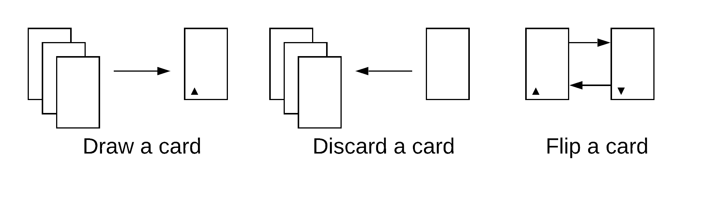

# Introduction

This is a role-playing game, or RPG, that uses 3x5 cards.
The cards supply rules for handling characters, challenges, combat, and so on.

Cards have two sides.
The front side has an up-arrow symbol and is generally good for the characters.
The back side has a down-arrow and is generally not good.
Many rules will involve flipping a card between one side and the other.

Cards have rules and writing prompts.
Cards also have symbols, showing you what kind of card they are.
Specific cards might call for other props, like dice or tokens.

## How much of this do I need to read?

You should read the sections on "the players", "the cards",
"setting up the game", and "starting the game".
Everything else is there to support, explain, or expand on these basics.

# The players

One player will be the Game Master (GM). All other players will create principal characters (PCs) and play those.

The GM has four areas of responsibility, described on individual cards:

* **Facilitator**, for managing spotlight and keeping the action going
* **Loremaster**, for answering questions about the world and the setting
* **Referee**, for answering rules questions
* **Storyteller**, for playing the ensemble characters (ECs) that the PCs will interact with

Whoever is playing the GM role should read these four cards for guidance.
All other players should read the "Principal" card for guidance.

# The cards

Cards fall into these categories:

* **Core rules** that describe how to play the game, or provide rules for other cards
* **Character cards** that describe the traits possessed by PCs
* **Condition cards** that reflect harm or hindrance affecting PCs
* **Encounter cards** that set up scenes and conflict for the PCs to deal with
* **Unique cards** that have their own rules or uses

## Using cards

The GM should arrange the cards into stacks, matching cards up by symbol.
For example, all condition cards should go together in a single stack.
Cards start out on the front face (indicated by an up-arrow) to begin with.

An individual card is either in play, or it's not.
Arrange cards in your play area such that it's clear which cards are or are not.
If a card is "discarded", it goes back to wherever you drew it from.

## Creating new cards

The group as a whole not only can create new cards, it should create new cards.
The existing cards are examples, meant to inspire.
The GM, in their Referee role, has the final say on whether a new card enters play or not.

# Setting up the game ("Session 0")

The GM will lead the group in answering the following questions.

**What is the genre or tone of the game?**
This can be "high fantasy", "dark gothic fantasy", and so on.
The pre-written cards lean toward a traditional fantasy game.
You can write new cards to enable a different experience.

**What are the pole stars for the game?**
Pole stars are in-game issues that motivate the characters.
See the section below for how to create issues.

**Who are the principal characters?**
Every player except the GM should create a PC.
See the section below for how to create PCs.

You can create PCs or issues in any order.
One group might want to decide on issues before they make characters.
Another group might do the reverse.
You might even create and then revise PCs as issues get discussed.

## Creating pole stars

Pole stars are what the game is "about", at least at the start of play.
They're elements of the game world like "rune magic" or "the dragons" or "the westward migration".

The group as a whole should decide on two pole stars to begin the game.
If the group is small (two or three PCs), pick only one pole star.
Discuss as a group what a pole star means, or leave some of it undecided.

Once you decide on pole stars, each player announces their PC's position toward it.
Tana _wants to learn_ rune magic, while Woody _mistrusts_ it.
Basler _is curious_ about it, but Emory _is ignorant_ of it.

Pole star positions shouldn't put PCs into direct conflict with each other.
If one person wants to kill dragons and another wants to protect them,
pick a new pole star.

If every character has a similar position, pick a new pole star.
If everyone thinks dragons are cool, pick a new pole star that's related to dragons,
like "dragon tamers". You can also pick something unrelated.
Dragons can still be in the game in that case, but not as a pole star.

A pole star is some focal point for character motivations.
Pole stars and positions can and should change in play.
The players will discover new things they care about.
Characters might take new positions on existing issues.
For example, the westward migration is underway in your game.
Players can revise their positions toward it, or the group can choose a new pole star.

The GM can write pole stars on individual cards,
and note down starting positions for each PC.

### Example pole stars and positions

* (Protect, manipulate, befriend, get help from) the young prince
* (Join, resist, investigate, distrust, infiltrate) a major religious order
* (Research, exploit, explore, warn the world about) the elemental imbalance

## Creating player characters

The GM should help other players create characters.
Ask driving questions and encourage collaboration between players.

Character cards fall into three groups:

* **Upbringing** tells us about a character's backstory and relationships
* **Role** tells us a character's motivation, goals, and nature
* **Focus** tells us about the tools or style a character uses to achieve their goals

Each player chooses one card from each of these groups, or draws one at random.
No two players should have the same card.
If a player doesn't have a strong idea of what they want to play, start by drawing at random.
Any player can put a card back and pick another one if they're unsatisfied with the card they got.

If you can't make your ideal PC from the existing cards, talk to the GM.
You can rewrite or create cards to match what you have in mind.
Characters should still begin with three total cards.

Once you create characters, the group can decide why they are together.
Look at the pole stars for ideas, or come up with something else.
Suppose that the game has a pole star like "the old forest".
One character wants to explore it.
Another went to stop their friend, fearing the forest's dangers.
A third is the guardian of the forest.
The group decides these three meet at the forest's edge.

# Starting the game ("Session 1")

One of the Pixar "rules of storytelling" is
"Once upon a time there was (blank). Every day, (blank).
One day, (blank). Because of that, (blank). Until finally, (blank)."

Character creation answers "once upon a time".
The group's next job is to answer "every day" and "one day".
You can do this in two ways:

**Get the players to feel comfortable inhabiting their characters**.
Start asking questions, and follow up on the answers with driving questions.
For example, ask "how does Tana spend her day on the farm?"
or ask "where do Emory's duties as squire take him?"
Follow through with these questions until people seem satisfied.

**Give the players something interesting to engage with**.
You can do this by creating an encounter. See "scenes and encounters" for details.

## Pole stars and session 1

By the end of session 1, each player should be able to answer this question for their PC:
"What does your PC need or want, that your position on (pole star) can provide?"

For example, Tana wants to explore the old forest. Why?
After a session of playing the character, the player says,
"Tana feels trapped at home and needs to spread her wings, so this is how she does it."

You might have an answer for this question right away.
You might not know it until you inhabit your PC for a bit.
Either way, the GM should make sure everyone has an answer
by the end of the first session.

# Scenes and encounters

A **scene** introduces characters,
sets up a source of tension, the lets them negotiate it.

Some scenes include an **encounter**, which can be a person, place,
or thing that the PCs must engage with.
This can be mean combat, exploration, negotiation, or any other kind of challenge.

## Starting and ending scenes

A scene starts when something is at stake,
or there's a pressing question,
and PC choices are how we resolve it.

A scene ends when the PCs settle the stake or answer the question.
The answer should create a new stake or question that propels PCs toward the next scene.
If the scene invalidates the stake or question,
pivot to the new stakes or question.
For example, a scene starts with the PCs kidnapping a princess.
It ends if they achieve this goal.
But if the princess escapes on her own,
the scene might pivot to pursuing her.

The GM should make sure the group understands:

* the stakes or the question facing the group
* the time and place for the scene, including details like weather
* any non-PC participants in the scene, including adversaries
* any special rules for handling the scene

The GM keeps the action flowing by moving the spotlight
and asking questions.
Once none of the scene participants seem to have anything else to do,
the scene ends.

## Genre conventions and safety tools

Sometimes, we play to find out what's going to happen next.
But often, we have some kind of assumption, stated or not,
about what can or can't happen.

For example, a destructive force like army or plague threatens a peaceful village.
Many gamers would be uncomfortable if this actually happens.
The group should respect that feeling.

The way to respect it is to change the stakes or the question that drive a scene.
For example, we can go from "does the village get annihilated"
to "what does it cost to save the village".
The challenge of trying to stop the event can be plenty exciting (and dangerous).

Some situations are narrative dead-ends.
If the PCs stay in jail for years, the game grinds to a halt, for example.
Change questions like "do we escape the dungeon" into "how do we escape the dungeon".
The PCs might encounter a prisoner who has a way out but needs their help to enact it.
Another hostile force might invade, freeing the PCs in the confusion.
Earthquakes or flooding might damage the dungeon itself.
You can assume the escape, and still make it dangerous and exciting.

## Building scenes from encounter cards

It's not always clear what the PCs should have to deal with next.
Examples of when this can happen:

* When the game first starts, and nobody's sure what should happen
* When the group thinks an encounter makes sense, but doesn't have a specific idea for one
* Whenever a surprise, interruption, or complication feels appropriate

In this case, you can create scenes from the encounter cards.

Draw two encounter cards at random.
Then draw an emotion card.
Think about the PCs, the pole stars, and the cards.
Then come up with a stake or question to frame the scene.

The emotion card suggests the dominant mood or feeling the scene should project.
The encounter cards tell us more about what the character(s) or situation(s)
in the scene can or will do.
The goal is to get the players thinking about specifics.
If any card doesn't feel right,
it's okay to discard and draw, pick a specific card, or write a new one.

### Example stakes and questions

* We need to reach the castle to warn the king
* What's the chieftain really planning?
* We have to escape the dungeon
* Why were these villagers rounded up for arrest?
* We want to find an old adventurer who knows about this amulet
* Which of these three spirits can we trust?
* We're trying to locate a farmer's lost sheep in a dangerous forest
* Can we get across the mountain pass in time?
* We need to scout the area for bandits
* What does the dragon want in exchange for the sapphire?

### Example scene

The GM draws "Tense", "Camp", and "Vigilance".
They interpret this as a camp of soldiers on high alert.
The scene can now begin with a couple of key questions or stakes:
"are the soldiers going to let us through?"
and "what are the soldiers guarding against?"

# Using character cards

You build a PC using character cards.
The cards don't tell us everything about your character, though.
Your PC has an identity, a backstory, friends, and so on.
Your PC can even be courageous, even if you don't have the "Courage" card.

What the cards tell us is what your PC's story is about.
When you take the "Courage" card, you're saying
"this will appear as a big element in my part of the game".

You use the front face of  your cards to achieve success,
as long as it applies. For example, you can stare down a brigand,
or leap through a fire, because you are courageous.
You can't translate an old book or locate stolen goods with Courage,
unless you explain how.

You use the back face of your cards to reinforce the elements of your story.
The writing prompts let you flip a card back when anyone - not only you -
narrates one of them.
For example, if someone else's courage falters, you can flip your "Courage" card back.

You can look for ways to support your fellow PCs' stories
by taking actions that flip their cards.
For example, "Instinct" says "Interrupt a plan mid-execution".
"Performer" says "Draw unwanted attention".
You can flip both cards back by using "Courage"
to interrupt a villain's plan and grab the focus.

## When to flip cards for success

You flip a character card from front to back to meet challenges.
For example, another player says "the crowd is rowdy,
it feels like it will be a challenge to calm them down".
You can flip "Performer" and say "because I'm a Performer,
I know how to work a crowd".

Sometimes, you want to flip a card because you feel it gives legitimacy to your action.
This is okay! As a player, you can challenge yourself.
If you do this, remind other players that you did.
It doesn't make sense to challenge an action twice for the same reason.
And it doesn't matter who posed the challenge,
if it makes sense that the action would be challenging.

# Using condition cards

Condition cards keep track of how hurt or inconvenienced each PC is at the moment.

The rules for condition cards are:

* You are bound by the fictional implications of the condition until discarded
* You can't take a condition that doesn't make things more complicated for you
* Play a condition card, face up, to get a hit
* Flip the card face down to aggravate the condition and get another hit
* Discard a face-up condition by spending a scene attending to it
* Discard a face-down condition by spending downtime attending to it
* Discard the card when its fictional context is no longer applicable

Condition cards do more than reflect damage.

**Providing success at a cost**

* The fighter wants to attack a target,
  but doesn't have another card they want to flip for success.
  They can trade injury to themselves or their weapons to get a hit.
  This would be the "Hurt" or "Undergeared" condition.
* The prophet is leading the way through the wilderness
  and needs to meet a challenge to get out.
  They can share their rations with the group to get everyone further,
  but go hungry in trade. This would be the "Weakened" condition.
* The thief wants to buy some new equipment in town, but can't find what they need.
  They can take the "Obliged" condition to get it from a crime-lord,
  who now has an interest in how they're using it.

**Driving drama and worldbuilding**

* The wizard becomes "Magicked". They can spend a scene to clear it -
  but what does that look like? Do they need to hunt for herbs in a guarded forest?
  Make a deal with an extradimensional entity?
  Consult a dangerous wizard colleague?
  Cast a spell of cleansing from an unknown spellbook?
* Will a character who has been "Mutated" by magic or ancient traps
  be well received in town, or by their family?
  Will they embrace the condition if it gives them power?
  Or will they make a dangerous bargain to undo it?
* As the enemy closes in, a character who is "Wanted" says
  "The rest of you go ahead, I'll hold them off."
  They spend a scene describing how they do so, buying time for the party to escape.
  If someone is "Pursued", it might take longer.
  The group might disperse into the forest for a week to let things cool down.

**When do conditions not apply?**

Conditions are temporary changes to a specific PC's life.
They aren't a list of limitations compared to some hypothetical standard of "normal".

* The monk who's been blind from birth doesn't have the "Hindered" condition card.
  A bard who overtaxes their voice might be "Hindered" until they recover.
* A noble character whose backstory says they're on the run
  from an evil relative isn't "Wanted".
  Another PC who angers the same relative might become "Wanted".
* A golem character who doesn't sleep can't take "Weakened"
  to get a success by staying awake all night.